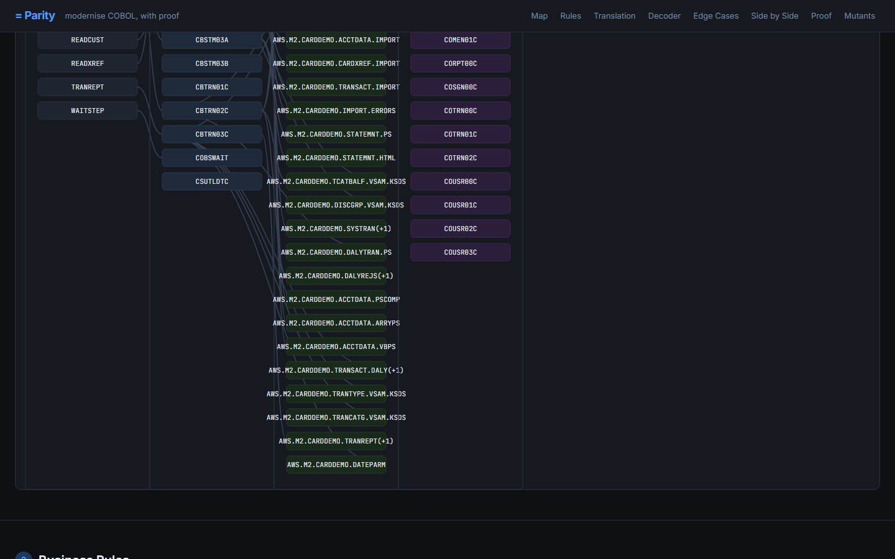
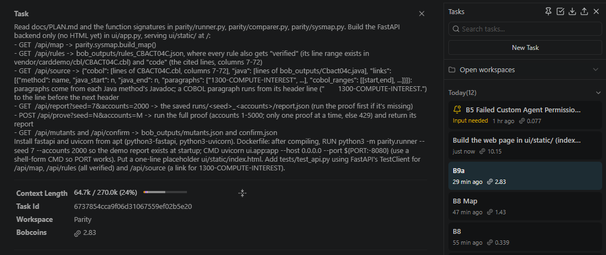

# Parity — COBOL-to-Java Equivalence Proof for Mainframe Migration

**Prove that a Java rewrite of a COBOL batch program produces identical output:
every record, every field, compared against the original COBOL running unmodified.**

**Live demo:** https://parity-wlag.onrender.com (press *Run proof on data it has never seen*)



---

## The Problem

Mainframe COBOL batch programs carry decades of implicit behaviour that is easy
to lose in translation: truncating interest (not rounding), overpunched signed
fields, test-before loop semantics, VSAM alternate-key reads, platform abend
calls.  A Java rewrite that passes code review and unit tests can still diverge
from the COBOL baseline by one cent per category — undetectable by spot-checking,
but material across a million-account portfolio at month-end.  Without an
automated equivalence proof there is no way to know whether the migration is
correct before it is too late.

---

## What Parity Does

| Step | Module | What happens |
|------|--------|-------------|
| **Map** | `parity/sysmap.py` | Parses JCL and COBOL source to produce a system map: programs, jobs, datasets, DD-name → DSN edges (31 programs, 14 batch, 17 online, 11 jobs in CardDemo) |
| **Rules** | `bob_outputs/rules_CBACT04C.json` | Bob reads the COBOL and its copybooks and writes a structured rule set — every calculation, fallback, and edge case — before any Java is written |
| **Rewrite** | `bob_outputs/Cbact04c.java` | Bob's COBOL Migrator mode rewrites the program in Java, including faithful reproduction of known bugs (last-account skip, empty fee stub) |
| **Proof** | `parity/runner.py` + `parity/comparer.py` | Generates 2,000 synthetic accounts, runs COBOL and Java against identical input, compares every output field; clock fields are format-checked |
| **Planted bugs** | `parity/mutation.py` | Injects six bugs into the Java source one at a time and verifies that each is detected — including a `double`-vs-`BigDecimal` case that changes only 2 of 3,321 transactions |
| **Report** | `bob_outputs/migration_report.md` | Full migration report for the bank's risk team: translation decisions, equivalence results, planted-bug results, known behaviours kept on purpose, gap found in test data, limitations, recommendations |



---

## How It Scales

- **The map is deterministic parsing.** `sysmap.py` reads JCL and COBOL text
  files; it does not run the programs.  Adding a new program means adding its
  source file to the vendor tree.

- **Bob sees one program at a time.** The rules step and the rewrite step each
  operate on a single COBOL program and its copybooks.  A 31-program system is
  31 focused sessions, not one enormous context.

- **The proof checks files at the program boundary.** The comparer reads the
  input and output flat files that COBOL and Java both write.  There is no
  assumption about the target language's internal data structures.  Any language
  that reads the same input files and writes the same output files can be proved
  equivalent: Java, Go, Python, C#.

---

## Run It

### Docker (full stack — COBOL + Java + web UI)

```bash
docker build -t parity .
docker run --rm -p 8080:8080 parity
# Open http://localhost:8080
```

The image compiles GnuCOBOL, OpenJDK 17, the Python harness, and
`bob_outputs/Cbact04c.java` in a single `debian:bookworm-slim` layer.

### CLI

```bash
# Equivalence proof — seed N, 2000 accounts
python3 -m parity.runner --seed 7 --accounts 2000

# Planted-bug (mutation) suite
python3 -m parity.mutation

# System map
python3 -m parity.sysmap
```

---

## How IBM Bob Built This

| Session | What Bob did |
|---------|-------------|
| [Plan](bob_sessions/parity_task01_plan_summary.png) | Plan mode read the COBOL source and all five copybooks, then wrote `docs/PLAN.md` — the full module design with directory tree, interface contracts, and build order |
| [Sandbox](bob_sessions/parity_task02_sandbox_summary.png) | Agent mode built the GnuCOBOL Docker sandbox and the COBOL harness (DRIVER, loaders, unloader) |
| [Generator](bob_sessions/parity_task03_generator_summary.png) | Agent mode wrote `parity/datagen.py` and `parity/copybook.py`, covering overpunched signs, all six edge-case account categories, and the DISCGRP DEFAULT fallback |
| [Rules](bob_sessions/parity_task04_rules_summary.png) | Agent mode analysed the COBOL and wrote `bob_outputs/rules_CBACT04C.json` and `bob_outputs/risk_report.md` — ten rules covering every non-trivial behaviour |
| [COBOL Migrator](bob_sessions/parity_task05_migrator_summary.png) | The custom **COBOL Migrator** mode (`.bob/custom_modes.yaml`) translated CBACT04C to `bob_outputs/Cbact04c.java` |
| [Proof](bob_sessions/parity_task06_proof_summary.png) | Agent mode wrote `parity/runner.py`, `parity/comparer.py`, and ran the first equivalence proof |
| [Mutations](bob_sessions/parity_task07_mutants_summary.png) | Agent mode wrote `parity/mutation.py` and `bob_outputs/mutants.json`; [session 7b](bob_sessions/parity_task07b_datagen_cycle_fix_summary.png) fixed the cycle-credit generator gap that had masked the cycle-reset mutant |
| [Map](bob_sessions/parity_task08_map_summary.png) | Agent mode wrote `parity/sysmap.py` and `bob_outputs/sysmap.json` |
| [B5a — first attempt](bob_sessions/parity_task05a_mode_no_tools_summary.png) | The custom mode initially had no tools enabled; the translation could not read files.  Fixed in `.bob/custom_modes.yaml` before B5 proper |
| [B9a — FastAPI backend](bob_sessions/parity_task09a_api_summary.png) | Agent mode wrote `ui/app.py` (FastAPI, four endpoints, thread-pool runner) |
| [B9b — web UI](bob_sessions/parity_task09b_web_partly_personal_summary.png) | Agent mode wrote `ui/static/index.html`, `app.css` and `app.js`: eight sections (system map, business rules, translation layer, record decoder, edge cases, byte-for-byte diff, live proof, planted bugs), no build step |
| [B10 — migration report + README](bob_sessions/parity_task10_report_personal_summary.png) | Agent mode wrote `bob_outputs/migration_report.md` and this README |

Tasks B1–B9a used the 40-Bobcoin hackathon allocation; part of B9b and all of B10 ran on my personal Bob plan.

Every session summary is saved as a screenshot in `bob_sessions/`.
The custom COBOL Migrator mode configuration is in `.bob/custom_modes.yaml`;
screenshots of the mode card and its tool permissions are in
`bob_sessions/parity_custom_mode_cobol_migrator.png` and
`bob_sessions/parity_custom_mode_cobol_migrator_tools.png`.

---

## Data Sources

See [DATA_SOURCES.md](DATA_SOURCES.md).

The source COBOL program is from the **AWS CardDemo** mainframe modernisation
sample application (Apache-2.0), vendored at `vendor/carddemo/`.  All test
accounts are synthetic, generated by `parity/datagen.py`.  No personal or
client data is used at any stage.

---

## Limitations

- **Batch-first.** The proof framework currently covers file-based batch
  programs.  CICS online programs and DB2-embedded-SQL programs require
  additional harness work (transaction stubs, SQL mocks) that is planned for a
  future phase.

- **Generated data can miss rare branches.** The datagen covers six known
  edge-case categories.  Unusual combinations of account group, transaction
  type, and category that do not appear in the generated seeds are not tested.
  Coverage-guided generation (tracking which COBOL branches are exercised) is
  the next planned improvement.

- **One program proved.** CardDemo has 31 programs.  CBACT04C is the first.
  The remaining 30 are not yet translated or proved.

---

## License

MIT — see [LICENSE](LICENSE).
